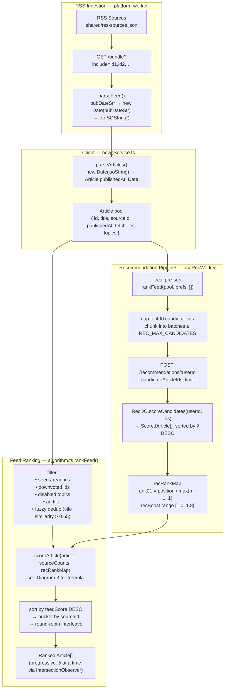
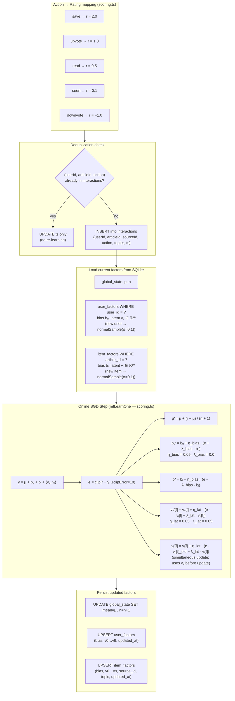
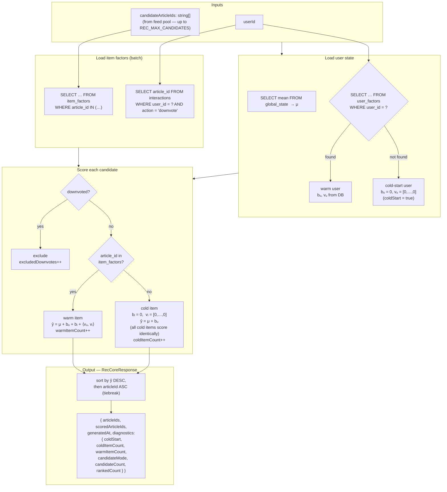
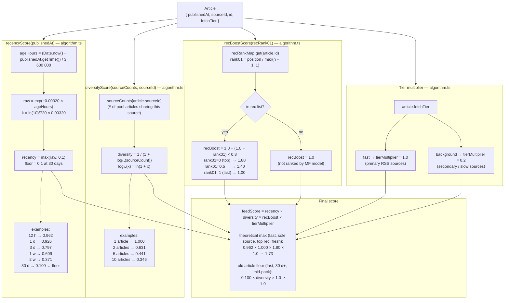
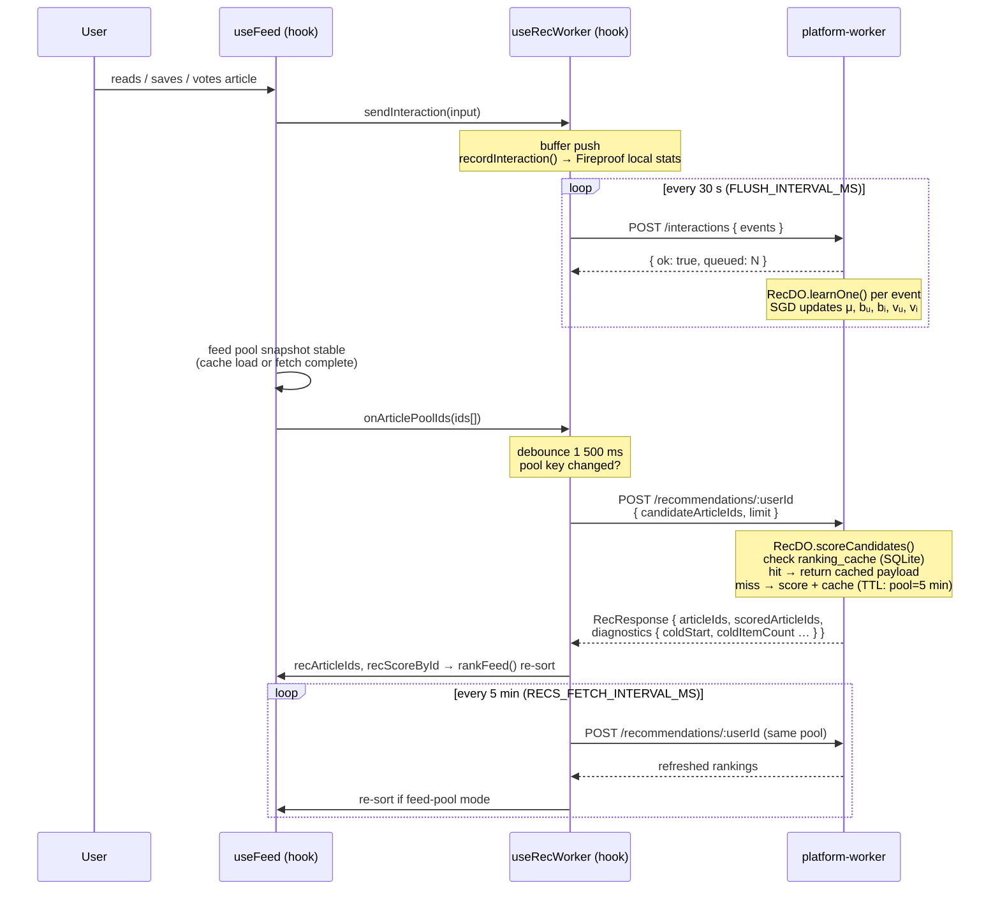

# Boomerang Scoring — Data Flow Diagrams

## 1. Article Ingestion → Ranked Feed

Full pipeline from RSS sources through MF ranking to the rendered feed.



---

## 2. MF Model — Online Training (learnOne)

How a single user interaction updates the global model state stored in the `REC_DO` Durable Object SQLite database.



---

## 3. MF Model — Inference (scoreCandidates)

How the trained model ranks candidate articles for a given user.



---

## 4. Feed Score Decomposition

How the four multiplicative factors combine into a single `feedScore` per article, mirrored identically in `algorithm.ts` (`scoreArticle`) and `feedScoreBreakdown.ts` (`computeFeedScoreInsight`).



---

## 5. Client-Side Rec Flush / Refresh Cycle

Timing diagram showing the interaction between the flush timer, pool ranking trigger, and the 5-minute periodic refresh.



---

## 6. Ricochet — Model Hyperparameters

Default values from `DEFAULT_MF_PARAMS` in `@victusfate/ricochet` `src/scoring.ts`.

| Parameter | Default | Notes |
|-----------|---------|-------|
| `nFactors` | 10 | Latent vector dimensionality `k` |
| `lrBias` | 0.05 | Learning rate for `bᵤ` and `bᵢ` |
| `lrLatent` | 0.05 | Learning rate for `vᵤ` and `vᵢ` |
| `l2Bias` | 0.0 | L2 regularisation on bias terms (off) |
| `l2Latent` | 0.05 | L2 regularisation on latent vectors |
| `clipError` | 10.0 | Error clipped to `[−10, +10]` before SGD |
| `sigmaInit` | 0.1 | Std dev for Box-Muller normal init of latent vectors |

Candidate pool sizes (boomerang-specific, in `recPoolMerge.ts`):

| Constant | Value | Meaning |
|----------|-------|---------|
| `REC_MAX_CANDIDATES` | 100 | Max ids per single POST /recommendations batch |
| `REC_POOL_CANDIDATE_CAP` | 400 | Max pool ids sent total (client truncates before chunking) |

Cache TTLs (exported from `@victusfate/ricochet` public lib API since v1.3.1; used in boomerang's `RecDO.ts` SQLite cache):

| Constant | Value | Scope |
|----------|-------|-------|
| `REC_FEED_POOL_CACHE_TTL_MS` | 5 min | Feed-pool mode (pool changes per refresh) |
| `REC_GLOBAL_CACHE_TTL_MS` | 1 hour | Global candidate mode (stable discovery results) |

---

## 7. Ricochet — Cache Architecture (Boomerang Override)

The standalone ricochet worker uses **KV** (`REC_STORE`) for caching recommendation snapshots.
Boomerang's `platform-worker` overrides this with **SQLite inside the Durable Object** (`ranking_cache` table in `RecDO.ts`) to avoid KV quota consumption.

```
ricochet standalone:
  RecDO → scores → Worker → KV.put(cacheKey, payload, { expirationTtl })
                    ↑
                 KV.get(cacheKey) on hit

boomerang platform-worker (override):
  RecDO._handleRecs():
    1. SQLite: SELECT payload FROM ranking_cache WHERE cache_key = ? AND expires_at > now
       → cache hit: return payload directly (no KV)
    2. Cache miss: super.fetch() → base RecDO scores candidates
    3. SQLite: INSERT OR REPLACE INTO ranking_cache (cache_key, payload, expires_at)
       → TTL: REC_FEED_POOL_CACHE_TTL_MS or REC_GLOBAL_CACHE_TTL_MS
```

Cache key format (boomerang `RecDO.ts`):

| Mode | Key |
|------|-----|
| Global (no candidates) | `recs:{userId}:global:{limit}` |
| Feed-pool | `recs:{userId}:pool:{sha256(sorted ids)[:24hex]}:{limit}` |

Cron (`/prune` POST, hourly): deletes expired `ranking_cache` rows + prunes interactions older than 30 days + removes `item_factors` for articles with no remaining interactions.

---

## 8. Ricochet — Offline Evaluation (MovieLens 100K)

Source: ricochet README. 100K ratings, 943 users, 1 682 items, 80/20 train/test split.

| Predictor | RMSE | MAE |
|-----------|------|-----|
| Global mean | 1.122 | 0.941 |
| Item mean | 1.017 | 0.811 |
| **BiasedMF** (`DEFAULT_MF_PARAMS`) | **0.930** | **0.733** |

Run locally: `cd platform-worker/node_modules/@victusfate/ricochet && make eval`
