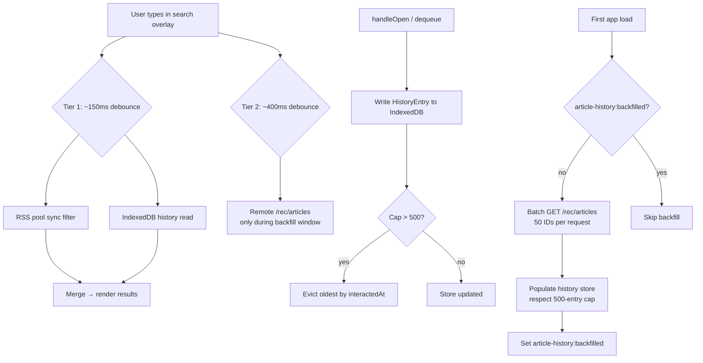

# Design: Article Search

## Canonical Vocabulary

| Term | Definition |
|---|---|
| **Search overlay** | Full-screen modal opened by the `🔍` header icon; dismissed by tap-outside or Escape |
| **Interaction history store** | Local IndexedDB store (`article-history:v1`) of full article metadata written at every read or dequeue event; capped at 500 entries, evict oldest by `interactedAt` |
| **Corpus** | The union of three sources searched on every query: RSS pool, Queue, and interaction history store |
| **History backfill** | One-time background migration on first app load: resolves existing `readIds` + `unsavedAtById` IDs via `/rec/articles` and populates the history store |
| **Tiered debounce** | Two-tier latency model: local results (RSS pool + history store) at ~150ms, remote resolution at ~400ms |
| **Scope chip** | Pill-style filter button (`[All] [Feed] [Queue] [History]`) reusing the existing `topic-pill` CSS class |
| **Paid tier hook** | 500-entry cap on the history store; "unlimited history" reserved as a future paid feature |
| **Dequeue** | Remove an article from the Queue — either by opening it (auto-dequeue) or by tapping ★ to unstar. Defined in `reading-queue/design.md`; used here as a write trigger for the history store |

---

## Problem

Auto-dequeue removes articles from the Queue on open, which is the right UX for reducing reading debt — but it makes previously-read or previously-saved articles invisible. Users lose the ability to find something they know they engaged with. Search closes this gap: a single overlay lets users search everything they've seen, queued, or read, regardless of when.

---

## Decisions

### D1 — Entry point: header icon → overlay

A `🔍` icon in the top header opens a full-screen search overlay. Dismissed by tap-outside or Escape. Does not consume a tab slot.

**Rationale:** The three-tab bar (Feed / Queue / Ranking) is already full. An overlay is the standard mobile pattern for cross-context search and avoids widening the nav.

### D2 — Corpus: RSS pool + Queue + interaction history

Three sources searched on every query:
1. **Current RSS pool** — articles in the live feed (`allArticles` + `savedArticles`)
2. **Queue** — subset of pool, surfaced separately in results
3. **Interaction history store** — local IndexedDB of past reads and dequeues

**Excluded:** Articles the user has only `seen` (scrolled past) but not opened or queued. `seenIds` is a ranking signal, not a memory signal.

### D3 — Filter chips: `[All] [Feed] [Queue] [History]`

Horizontal pill row directly below the search input, reusing `.topic-pill` / `.topic-pill.active` CSS classes from the existing `TopicFilter` component.

- **All** — merged results across all three sources, ordered by match quality then recency
- **Feed** — current RSS pool only
- **Queue** — `savedArticles` only
- **History** — interaction history store only (reads + dequeues not currently in pool)

**Rationale:** Matches existing visual language exactly. Chip-based filtering already understood by users from the Feed tab.

### D4 — Interaction history store (IndexedDB)

New IndexedDB key `article-history:v1` storing an array of:

```ts
interface HistoryEntry {
  id: string;
  title: string;
  url: string;
  source: string;
  sourceId: string;
  publishedAt: string;   // ISO string
  interactedAt: number;  // epoch ms — used for eviction ordering
}
```

- **Written** on `handleOpen` (read) and on dequeue (auto or manual unstar)
- **Cap:** 500 entries; on overflow, evict the entry with the oldest `interactedAt`
- **Eviction** is synchronous with each write — no background pruning needed
- **Paid tier hook:** Cap constant extracted as `HISTORY_STORE_MAX = 500`; upgrade path raises or removes this cap

### D5 — History backfill on first load

On first app load after the feature ships (detected by absence of the `article-history:backfilled` key in IndexedDB), a background task resolves all existing `readIds` + `unsavedAtById` IDs via a single `POST /rec/articles` request (up to 500 IDs in body) and writes them to the history store, respecting the 500-entry cap (most recent interactions win).

- Runs in a `useEffect` with an `isFirstRun` guard stored in IndexedDB (`article-history:backfilled`)
- Does not block the UI — completes in the background
- Uses `POST /rec/articles` (now live in platform-worker); `ARTICLES_POST_MAX = 500` matches the history store cap exactly — backfill is always a single request

### D6 — Tiered debounce (as-you-type)

Results render as the user types using two latency tiers:

| Tier | Source | Debounce | Rationale |
|---|---|---|---|
| 1 | RSS pool (sync) + history store (IndexedDB) | ~150ms | Both are effectively instant at ≤500 entries; single debounce covers both |
| 2 | Remote `/rec/articles` | ~400ms | Only needed during backfill window for IDs not yet local |

After backfill completes, Tier 2 is never triggered — all results come from Tier 1.

### D7 — Result card shape

Reuse `ArticleCard` for RSS pool / Queue results. History-only results (not in current pool) use a lighter card variant showing title, source, and `publishedAt` — same layout, no score badge, no vote buttons (article is no longer in the ranking context).

### D8 — `showSearch` state, not a new `FeedView` value

The overlay renders as a layer on top of the current view. A separate `showSearch: boolean` state in `App.tsx` controls visibility — `view` (`'feed' | 'saved' | 'rec'`) does not change when search opens or closes. `FeedView` is not extended.

**Rationale:** The overlay is not a navigation destination; it is a transient layer. Adding `'search'` to `FeedView` would bleed search concerns into tab routing, sync logic, and topic filter visibility checks.

---

## Data Flow



---

## Edge Cases

| Scenario | Behavior |
|---|---|
| Article in history store but also in current RSS pool | Pool result takes precedence; shown under Feed chip, not History |
| History store not yet backfilled, user searches immediately | Tier 1 (pool) results show at 150ms; Tier 2 resolves remaining history matches remotely at 400ms |
| `/rec/articles` returns `missing` IDs during backfill | Skip silently — article aged out of 180-day KV window |
| User opens search overlay with empty query | Show empty state: "Search your feed and reading history" |
| Search query matches nothing in any tier | "No results for [query]" |
| 500-entry cap hit during backfill | Most recent `interactedAt` entries win; oldest dropped |

---

## Out of Scope

- Unlimited history (future paid tier)
- Full-text search of article description/body (title + source only)
- Cross-device sync of the local history store
- Server-side search index
- POST `/rec/articles` batch endpoint (see `ricochet-changes.md` — optional improvement)
