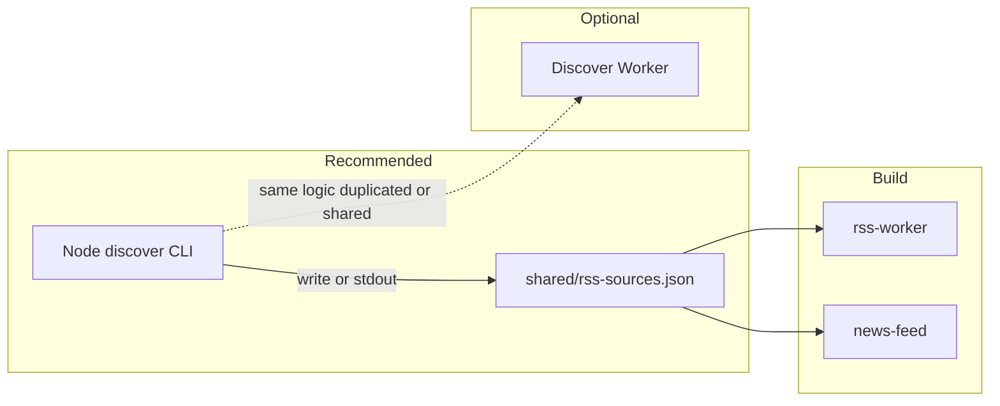

# Manual discovery + committed JSON catalog (replaces static lists)

## Phase 1 scope: Node CLI only (polite crawling)

Ship the **discover CLI** before curator UI or any Worker. Required behavior:

1. **User-Agent** — A single, stable **polite bot** string (identify the project + repo contact), e.g. `BoomerangFeedDiscovery/1.0 (+https://github.com/victusfate/boomerang)`, sent on every fetch (seed HTML + feed smoke checks). No rotating “fake browser” UAs.
2. **Serial requests** — Process **one seed URL at a time**; do **not** parallelize seed fetches (keeps QPS minimal and avoids burst patterns).
3. **Backoff** — After each seed completes (success or failure), **wait** before the next: configurable `DELAY_MS` (e.g. 750–2000 ms) plus small **random jitter** (e.g. 0–300 ms) to avoid synchronized retries.
4. **Retries** — On **429** or **5xx**, optional **limited retries** with **exponential backoff** (cap attempts); on repeated failure, log and continue to next seed.
5. **Allowlist** — Seeds only from `SEED_URLS` or config file; same discovery logic (parse alternates, SSRF checks, smoke-validate feeds, merge/dedupe) as elsewhere in the plan.

**Phase 2+ (explicitly not phase 1):** curator UI, optional Cloudflare discover Worker.

## Opinion: Node CLI first, discover Worker optional

**Yes — a local Node/CLI tool can perform the same crawls** as a Cloudflare Worker: `fetch` (or `undici`) to download HTML, parse `<link rel="alternate">`, validate feed URLs, same SSRF rules. There is **no CORS** restriction for server-side Node.

For a **maintainer-only** flow whose output is a **file you commit**, a **CLI in the repo** is often **preferable**:

- **One deployable fewer** — no Wrangler project, secrets, or CORS for a browser UI.
- **Writes `shared/rss-sources.json` directly** (or stdout → redirect) — no copy-paste from a Worker response.
- **Easier debugging** — breakpoints, logging, run unchanged in CI (`node scripts/discover.mjs`).
- **Shared code** — extract discovery into a small `packages/` or `scripts/` module; Worker could be a thin wrapper later **if** you want it.

**When a discover Worker still helps:**

- **No Node** on the machine doing curation (rare for this repo’s maintainers).
- **Hosted trigger** — someone wants to hit a URL from a browser without running CLI (still gated by secret).
- **CI** that prefers `curl https://…/export` over `npm run discover` — though CI can run Node just as easily.

**Recommendation:** implement **Node CLI as the source of truth** for discovery logic; add a Worker **only if** you want one of the above. The plan todos treat Worker as **optional**.

## Egress, blocking, VPN, and Worker vs local CLI

**Will origins block you?** Sometimes. Discovery is a **small set of GETs** to allowlisted seed homepages (not aggressive crawling). Blocks still happen: **429** rate limits, **403** bot rules, **Cloudflare challenges** (HTML challenge page instead of real HTML), or **WAF** rules by IP or User-Agent.

**VPN?** It changes your **egress IP**, not the fact you are a script.

- **Consumer VPN** IPs are often **datacenter-ish** and can be **worse** than your home ISP for “looks like a normal user” (many sites block known VPN ranges harder than residential).
- **Residential proxies** exist but are a different product; overkill for maintainer seed discovery.
- **Practical advice:** try **without** VPN first; if one seed consistently fails, fix **that** relationship (different URL, official RSS doc link, or add the feed manually to JSON) rather than assuming VPN fixes it.

**Cloudflare Worker egress vs your laptop**

| Factor | Local Node CLI | Discover Worker |
|--------|----------------|-----------------|
| **IP / ASN** | Your ISP (often “residential”) | Cloudflare edge (AS13335 — **datacenter**; widely known) |
| **Reputation** | Small volume from home IP can look like a person | Some sites **trust** requests from CF; others **block or challenge** non-browser traffic from hosting/CDN ranges |
| **Same HTML?** | Same `fetch` + UA — if the site returns a **challenge page**, both get garbage HTML unless you use a full browser | Same limitation — Workers do **not** run a headless browser |
| **Rate limits** | Easy to add **delays** between seeds (`setTimeout`) | Same — stagger in Worker |
| **Ops** | Runs where you run it (home, CI IP) | Always CF egress |

**Neither** option is a magic bypass for **anti-bot** (CAPTCHA, JS challenges, PerimeterX). For those, you would need **Playwright/Puppeteer** (not in Worker) or **manual** feed URLs — out of scope for a simple discover script.

**Is the Worker “better” for not getting blocked?** **Not automatically.** It is a **different** IP class (CF anycast vs your ISP). For **news sites that sit behind Cloudflare**, edge-to-origin can behave well; for **sites that block datacenter IPs**, your **home** IP might work **better**. There is no universal winner — **empirical** for your seed list.

**Hygiene:** For the **Node CLI (phase 1)**, implement exactly the **polite UA + serial + backoff** rules in [Phase 1 scope](#phase-1-scope-node-cli-only-polite-crawling). For any future Worker wrapper, mirror the same behavior.

- **Allowlist only** — no open-ended crawling.
- If HTML is nonsense, **fall back**: paste RSS URL into JSON by hand (curator UI in phase 2 can help).

## What you asked for

- **Expand** the list via seed crawl (allowlisted seeds, `<link rel="alternate">`, validation).
- **Result** is a **JSON blob in the repo** you **commit**, which becomes the **single source of truth** and **replaces** the duplicated static arrays in [`rss-worker/src/sources.ts`](rss-worker/src/sources.ts) and [`news-feed/src/services/newsService.ts`](news-feed/src/services/newsService.ts).

## Critical constraint (Node vs Worker)

| Approach | Writes repo file directly? |
|----------|----------------------------|
| **Node CLI** | **Yes** — script runs on your machine and can write `shared/rss-sources.json`. |
| **Worker** | **No** — returns HTTP body; you still save to disk and commit. |

With a CLI-first flow, the “Worker cannot write locally” limitation goes away for the default path.

## Why keep discovery separate from `rss-worker` (the bundle worker)

- **Isolation**: crawling is heavier and unrelated to user-facing `/bundle`, `/og-image`, `/image`.
- Whether that logic lives in **Node** or a **separate Worker**, keep it **out of** [`rss-worker/src/index.ts`](rss-worker/src/index.ts) so production feed traffic stays lean.

## Repo layout

| Piece | Role |
|-------|------|
| `shared/rss-sources.json` (name TBD) | Committed array of sources (`id`, `name`, `feedUrl`, `category`, `enabled`, `priority`). **Canonical list.** |
| `scripts/` or `packages/rss-discover/` | Node CLI — discovery, merge, write JSON. |
| `rss-discover-worker/` | **Optional** Wrangler app — same behavior over HTTP for hosted use. |
| `rss-worker` | At build: import from `shared/rss-sources.json` — **no runtime fetch** of catalog. |
| `news-feed` | Same import so Settings and `include=` stay aligned. |

**Merge behavior (optional):** first run can seed from exported JSON once; later runs merge discovered feeds (dedupe by `feedUrl`).

## Discovery logic

- Allowlisted `SEED_URLS` only (env or config file).
- **Transport (phase 1 CLI):** polite UA, serial seed fetches, inter-seed delay + jitter, bounded retries with backoff on 429/5xx — see [Phase 1 scope](#phase-1-scope-node-cli-only-polite-crawling).
- Parse HTML for RSS/Atom alternate links; resolve URLs; same SSRF-style rules as [`isAllowedOgFetchUrl`](rss-worker/src/ogImage.ts) (shared utility in repo).
- Smoke-validate feeds (prefix or reuse [`parseFeed`](rss-worker/src/parseFeed.ts) from a shared module).
- Caps: max feeds per seed, max total output, block noisy patterns.

## Explicit non-goals

- **No** Cloudflare KV (or other DB) for the canonical catalog.
- **No** scheduled / cron triggers for discovery.
- **No** runtime catalog fetch in the shipped PWA for defaults — the app ships the list **from committed JSON at build time** (same as today, but one file).

## Tradeoffs

| Pros | Cons |
|------|------|
| Reviewable PRs; full Git history | Stale until someone runs discover + commit |
| CLI: no extra deployable, direct file write | Maintainers need Node for the default path |
| Optional Worker only if you want hosted discover | If you add Worker: duplicate surface or shared package |

## Optional later: automate the commit

GitHub Actions can run `npm run discover` and open a PR — no Worker required.

## Curator UI (phase 2 — after CLI)

- **Table** over discover output: edit/delete rows, merge with pasted `shared/rss-sources.json`, export or copy.
- Run discover via CLI → paste JSON into UI, **or** a **local** dev server that shells out to the same discovery module — avoids CORS entirely.
- Optional Worker-hosted discover remains **deferred**; not required for this UI.

## End users: OPML vs maintainer tools

(Unchanged conceptually — see previous iterations.)

- **All users:** OPML / custom feeds in Settings (Fireproof) — separate from maintainer catalog.
- **Seed crawl in browser:** CORS blocks most sites; **Node CLI** or **local server** avoids that for power users.

**Summary table (updated)**

| Capability | All users (PWA) | Maintainer |
|------------|-------------------|------------|
| OPML import/export, custom RSS URLs | Yes — Fireproof-backed | N/A |
| Seed crawl → suggest feeds for repo | N/A | **Node CLI** (default) or optional discover Worker |

## Testing

- Unit tests for HTML parsing in the discover module (fixtures).
- **Integration / dry-run:** run against 1–2 known seeds; confirm logs show **serial** order, **delay** between seeds, and UA header on outbound requests (log or mock `fetch`).
- `npm run discover` → diff `shared/rss-sources.json` → `npm run build` in `rss-worker` and `news-feed`.

## Risks

- Seed pages yield junk feeds — limits + manual review before commit.
- If you add a discover Worker, gate it (secret / Access); do not expose unauthenticated crawl URLs.
