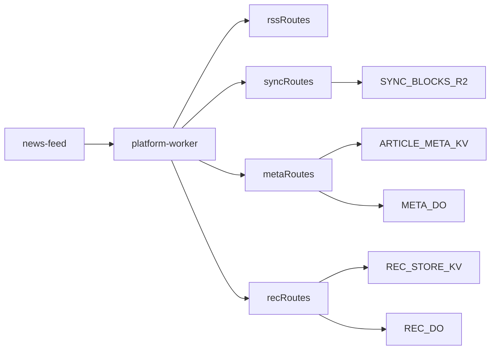

# Worker Topology Consolidation Plan

## Goal
Move from four runtime workers (`rss`, `sync`, `meta`, `rec`) to one deployable Worker so you do not need to manage expanding worker sprawl as features grow.

## Target Architecture
- One Worker app with route modules:
  - `GET /bundle`, `/og-image`, `/image`, `/health` (rss domain)
  - `/sync/*` (sync domain)
  - `/meta`, `/meta/tags`, `/ws` (meta domain)
  - `/interactions`, `/recommendations/:userId` (rec domain)
- Keep existing URL shapes to minimize frontend change.
- Keep current data bindings in one `wrangler.jsonc`:
  - `SYNC_BLOCKS` (R2)
  - `ARTICLE_META` (KV)
  - `REC_STORE` (KV)
  - `META_DO`, `REC_DO` (Durable Objects)



## Execution Breakdown (Tracer-Bullet Slices)

### Slice 0: Skeleton and Compatibility Contract
**Purpose:** establish a unified worker shell with zero behavior change.

- Create `platform-worker/` with one fetch router and route namespaces:
  - `/rss/*`, `/sync/*`, `/meta/*`, `/rec/*` internally
  - preserve external paths (`/bundle`, `/sync/*`, `/meta*`, `/interactions`, `/recommendations/*`)
- Define one shared `Env` interface for all bindings.
- Add temporary health endpoints per domain (`/health/rss`, `/health/sync`, `/health/meta`, `/health/rec`) for migration diagnostics.

**Acceptance criteria**
- New worker boots locally.
- `GET /health` and domain health routes respond.
- No frontend changes yet.

---

### Slice 1: Move RSS Domain First (Lowest Coupling)
**Purpose:** migrate feed fetch surface into unified worker with current semantics.

- Port:
  - `rss-worker/src/index.ts`
  - supporting modules (`parseFeed`, `rssFetch`, `ogImage`, `sources`)
- Preserve route behavior for:
  - `GET /bundle`
  - `GET /og-image`
  - `GET /image`
  - CORS + error shape
- Keep same timeouts and batching rules.

**Acceptance criteria**
- `news-feed` loads articles from unified worker URL without regressions.
- Progressive batches still function via existing `onBatch` client flow.

---

### Slice 2: Move Sync Domain (Security-Sensitive)
**Purpose:** preserve token-auth + R2 correctness while consolidating runtime.

- Port:
  - `sync-worker/src/index.ts`
  - `sync-worker/src/auth.ts`, `room.ts`, `cors.ts`
- Keep exact HTTP contract for:
  - `POST /sync/room`
  - `GET|PUT /sync/{roomId}/meta`
  - `GET|PUT /sync/{roomId}/blocks/{cid}`
  - `DELETE /sync/{roomId}`
- Keep ETag / If-Match conflict semantics unchanged.

**Acceptance criteria**
- Existing share-link and sync flows pass unchanged in `news-feed`.
- No auth regression in token validation.

---

### Slice 3: Move Meta Domain + Durable Object
**Purpose:** consolidate metadata/WebSocket behavior while retaining DO lifecycle.

- Port:
  - `meta-worker/src/index.ts`
  - `meta-worker/src/MetaDO.ts`
  - `meta-worker/src/tags.ts`
- Keep:
  - `GET /meta`
  - `POST /meta/tags`
  - `GET /ws` websocket upgrade
  - scheduled prune path
- Preserve `ARTICLE_META` KV and `META_DO` class naming/migrations.

**Acceptance criteria**
- Metadata banner errors disappear under unified worker.
- WS subscribe/catch-up behavior remains stable.
- Scheduled prune still executes.

---

### Slice 4: Move Rec Domain (Adapter-First)
**Purpose:** integrate rec endpoints with minimal risk from external package coupling.

- Add rec adapter module that delegates to current implementation in `rec-worker/src/index.ts`.
- Keep:
  - `POST /interactions`
  - `GET /recommendations/:userId`
- Preserve `REC_STORE` KV and `REC_DO`.

**Acceptance criteria**
- Recommender bootstrap logs show server recommendation success path under unified worker.
- Fallback logging remains as currently implemented in frontend hooks.

---

### Slice 5: Frontend Env Consolidation
**Purpose:** collapse four worker env vars to one canonical base URL.

- Introduce `VITE_PLATFORM_WORKER_URL`.
- Update:
  - `news-feed/src/config/workerEnv.ts`
  - `news-feed/src/services/newsService.ts`
  - `news-feed/src/hooks/useSyncWorker.ts`
  - `news-feed/src/hooks/useMetaWorker.ts`
  - `news-feed/src/hooks/useRecWorker.ts`
  - `news-feed/src/vite-env.d.ts`
- Maintain fallback compatibility with old vars during transition.

**Acceptance criteria**
- Local dev runs with one worker URL.
- CI can still run while old vars are phased out.

---

### Slice 6: CI, Local Tooling, and Cutover
**Purpose:** complete operational simplification and retire old deployments.

- Update:
  - `.github/workflows/deploy.yml` to deploy unified worker artifact.
  - `Makefile` to use one worker start/stop workflow by default.
  - `news-feed/.env.example` to document unified URL-first config.
- Perform staged cutover:
  - deploy unified worker to staging URL
  - run end-to-end smoke for rss/sync/meta/rec
  - switch production URL
  - retire legacy workers after burn-in

**Acceptance criteria**
- One worker deployment in active use.
- Legacy workers no longer required for normal operation.
- Dev runbook uses one worker by default.

## Risks and Controls
- **Rec module coupling risk**: `rec-worker` delegates to external package; mitigate with adapter wrapper and explicit route tests.
- **DO migration risk**: ensure same class names + migration tags; avoid accidental namespace resets.
- **Blast-radius increase**: one worker means one deploy affects all domains; mitigate by strict module boundaries and route test gates.

## Definition of Done
- One deployed worker URL powers RSS, sync, meta, rec APIs.
- Frontend requires one worker env var (with temporary compatibility fallback).
- Existing user data remains intact in KV/R2/DO.
- Legacy workers are removed from active deploy and local runbook.

## High-Level Worker Shape

- One deployable `platform-worker` with modular internal domains.
- One entrypoint (`fetch`, `scheduled`) routes to:
  - `rssDomain` for `/bundle`, `/og-image`, `/image`
  - `syncDomain` for `/sync/*`
  - `metaDomain` for `/meta`, `/meta/tags`, `/ws`
  - `recDomain` for `/interactions`, `/recommendations/:userId`
- Shared bindings remain unchanged:
  - `SYNC_BLOCKS` (R2)
  - `ARTICLE_META` (KV)
  - `REC_STORE` (KV)
  - `META_DO`, `REC_DO` (Durable Objects)

### Request Routing (ASCII)

```text
                    +----------------------------------+
Client (news-feed)  |      platform-worker (single)   |
------------------->|----------------------------------|
                    |  fetch(req, env, ctx)            |
                    |    |- route /bundle,*image  ---> rssDomain
                    |    |- route /sync/*        ---> syncDomain
                    |    |- route /meta*,/ws     ---> metaDomain
                    |    |- route /interactions,*recs -> recDomain
                    |    \- default 404 / health
                    +----------------------------------+
```

### Domain Data Flow (ASCII)

```text
[RSS domain]
Client -> /bundle,/og-image,/image -> rssDomain
rssDomain -> upstream RSS feeds (HTTP fetch)
rssDomain -> ARTICLE_META (read tags to inline into bundle)
rssDomain -> response articles

[Sync domain]
Client -> /sync/*
syncDomain -> token verify
syncDomain <-> SYNC_BLOCKS (R2)
syncDomain -> response meta/blocks

[Meta domain]
Client -> /meta,/meta/tags,/ws
metaDomain <-> ARTICLE_META (KV)
metaDomain <-> META_DO (websocket fanout + coordination)
metaDomain -> response tags/acks/events

[Rec domain]
Client -> /interactions,/recommendations/:userId
recDomain <-> REC_STORE (KV)
recDomain <-> REC_DO (stateful rec coordination/training cache)
recDomain -> ranked articleIds
```

### Scheduled and WebSocket Flows (ASCII)

```text
                +-------------------+
Cron (scheduled)| platform-worker   |
--------------->| scheduled(event)  |
                +---------+---------+
                          |
                          v
                    metaDomain.prune()
                          |
                          v
                        META_DO -----> ARTICLE_META (cleanup/compaction)
```

```text
WebSocket path:
Client ws://.../ws -> platform-worker -> META_DO (single logical hub)
                                      -> broadcasts tag updates to subscribers
```

## Initial Workstream Todos
- Slice 0: build unified skeleton and compatibility contract.
- Slice 1: migrate RSS routes and verify progressive loading behavior.
- Slice 2: migrate sync routes with auth + ETag semantics preserved.
- Slice 3: migrate meta routes + `META_DO` + scheduled prune.
- Slice 4: migrate rec routes via adapter and validate recommendation bootstrap.
- Slice 5: switch frontend to single worker URL with compatibility fallback.
- Slice 6: simplify CI/dev scripts, execute staged cutover, retire legacy workers.
